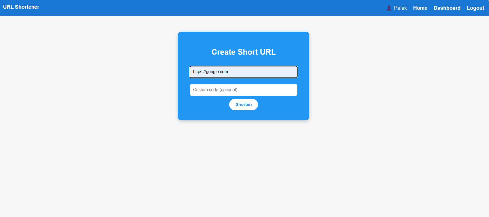
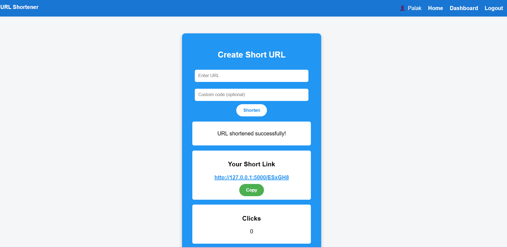
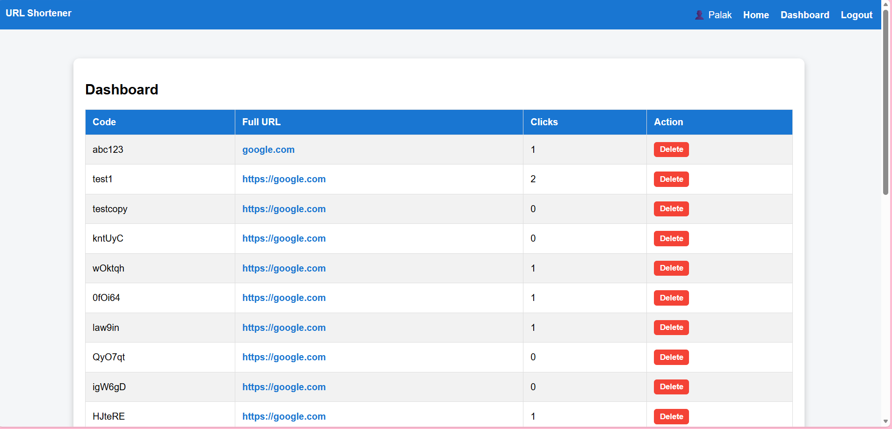
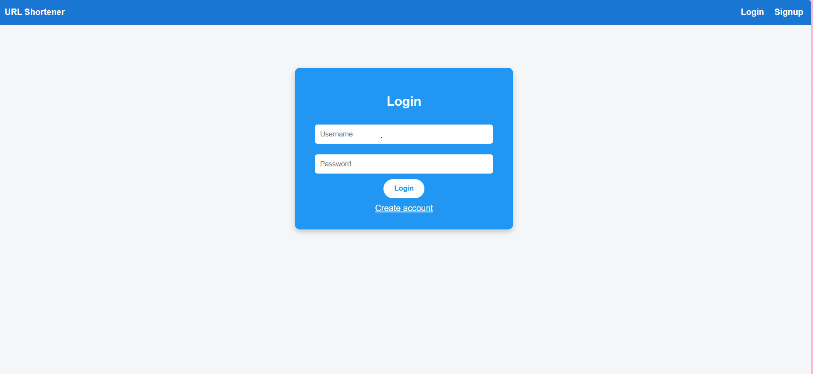
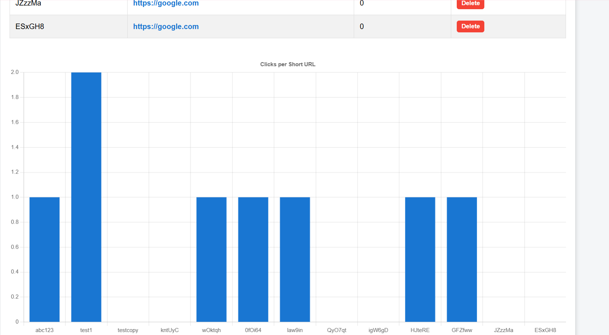

# URL Shortener Web App

A professional URL shortening web application built with **Flask**.  
Allows users to create short URLs, track click statistics, and manage links via a user-friendly dashboard.

---

## Live Demo

Try the live app here: [Your Deployed App URL](https://example.com)  
*(Replace the link above with your actual deployed URL once your app is live)*

---

## Features

- ✅ User authentication: Sign up, login, and logout  
- ✅ Create short URLs with optional custom codes  
- ✅ Dashboard to view all URLs, clicks, and delete links  
- ✅ Click analytics chart for each URL  
- ✅ Clean and professional UI

---

## Tech Stack

- **Backend:** Python 3, Flask  
- **Database:** SQLite  
- **Frontend:** HTML, CSS  

---

## How to Run Locally

1. Clone the repository:  
   ```bash
   git clone https://github.com/palak444/url-shortener.git
   cd Linkshortener


## Screenshots





